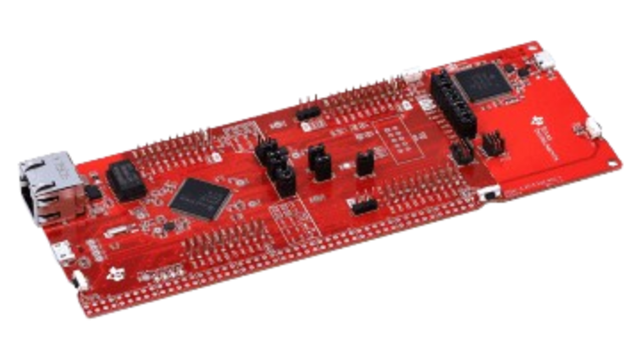
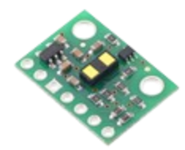
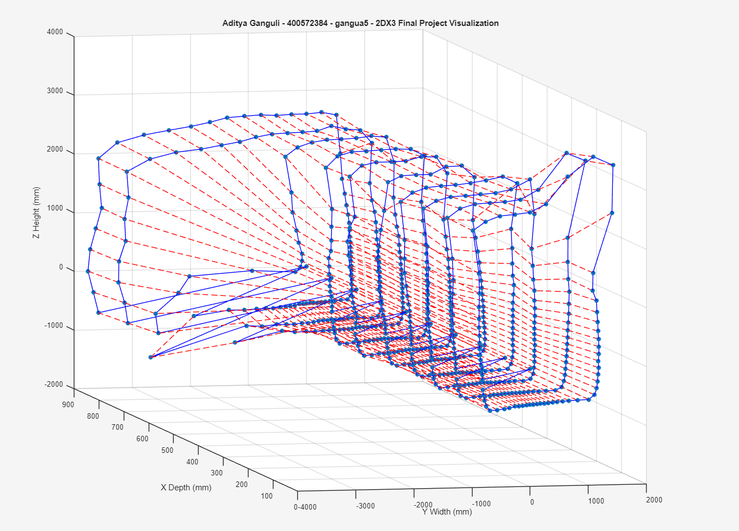
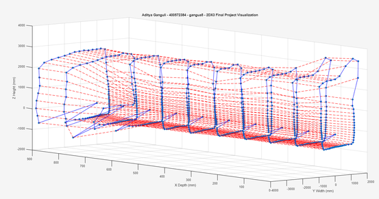
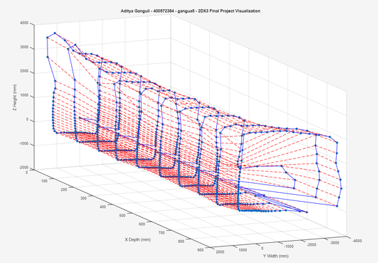

# Small-Scale LiDAR Scanner

      
      &nbsp;&nbsp;&nbsp;&nbsp;&nbsp;&nbsp;&nbsp;&nbsp;
      
      &nbsp;&nbsp;&nbsp;&nbsp;&nbsp;&nbsp;&nbsp;&nbsp;
      

### Overview
This project is a low-cost, portable LiDAR (Light Detection and Ranging) scanner engineered for 3D spatial mapping of indoor environments. It was developed as a final project for the COMPENG 2DX3 course at McMaster University. 

The system captures discrete distance measurements across a full 360-degree vertical plane using a Time-of-Flight (ToF) sensor mounted on a stepper motor. A MATLAB script processes the serial data, converting polar coordinates into Cartesian coordinates to render a complete 3D graphical wireframe of the scanned space.

### Features
* **Automated 3D Mapping:** Generates a 3D spatial mesh map using MATLAB processing.
* **Dual Serial Communication:** Utilizes I2C (100 kbps) for sensor-to-microcontroller data transfer and UART (115200 bps) for microcontroller-to-PC transmission.
* **Detanglement Protocol:** Automatically reverses the stepper motor's direction after each scan to unspool the ToF sensor wires, preventing damage.
* **Visual Diagnostics:** Integrates onboard microcontroller LEDs to indicate measurement captures, UART transmission events, and active detanglement processes.

### Hardware Architecture
* **Microcontroller:** Texas Instruments MSP-EXP432E401Y (ARM Cortex-M4) operating at a 22 MHz bus speed.
* **Distance Sensor:** Pololu VL53L1X Time-of-Flight (ToF) Sensor.
* **Motor:** 28BYJ-48 Stepper Motor (Unipolar).
* **Driver:** ULN2003 Stepper Motor Driver Board.

### Pin Configuration
**Motor (Port H)**
* `PH0` -> IN1
* `PH1` -> IN2
* `PH2` -> IN3
* `PH3` -> IN4

**ToF Sensor**
* `PB2` -> SCL
* `PB3` -> SDA
* `+3.3V` -> Vin
* `GND` -> GND

**Onboard Controls (Port J)**
* `PJ1`: Start scanning sequence.
* `PJ0`: Reset/Home the motor to its original position.

**LED Status Indicators**
* `PF4` (LED3): Measurement Status (flashes at each step angle).
* `PF0` (LED4): UART Tx Status (flashes when transmitting data).
* `PN0` (LED2): Detangle Status (flashes during the wire detangling protocol).

### How to Run

#### 1. Hardware Setup
Connect the VL53L1X sensor and the ULN2003 driver board to the microcontroller according to the pin configuration. Ensure the ToF sensor's emitter and receiver are facing upward. Connect the microcontroller to your PC via the MicroUSB port.

#### 2. Software Initialization
1. Open the project in Keil uVision IDE, compile the code, and load it onto the microcontroller.
2. Identify your UART COM port using Windows Device Manager.
3. Open `matlabscript.m`. Update the `serialport` line with your designated COM port and the `115200` baud rate.
4. Set the `depth` variable in the MATLAB script to your desired number of manual x-axis physical displacements. 

#### 3. Execution
1. Run the MATLAB script and tap "Enter" in the command window so the script begins listening for data.
2. Press the **PJ1** button on the microcontroller to begin the first 360-degree rotation.
3. Wait for the array of data to print to the MATLAB console and allow the microcontroller to finish the detangling process (indicated by LED2 flashing). 
4. Move the physical scanner forward by the set displacement amount (default is 100 mm) and press **PJ1** again.
5. Repeat this process until your defined `depth` is reached. A 3D scatter plot wireframe will automatically generate in MATLAB once all points are collected.

### Known Limitations
* **Range Restrictions:** The ToF sensor maxes out at a distance measurement of 4 meters, making it strictly applicable for indoor scans.
* **Execution Speed:** Scanning speed is inherently bottlenecked by the stepper motor's velocity, the sensor requiring the motor to pause to accurately gather data (20-1000ms), and the required time to detangle the sensor wiring after each full rotation.
* **Hardware Precision:** The inexpensive 28BYJ-48 stepper motor introduces a +/- 5% error per step, which can cause minor spatial deviations in the final visualization.

### Scan Images

